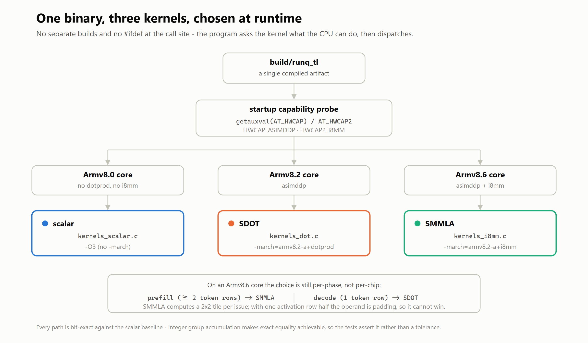
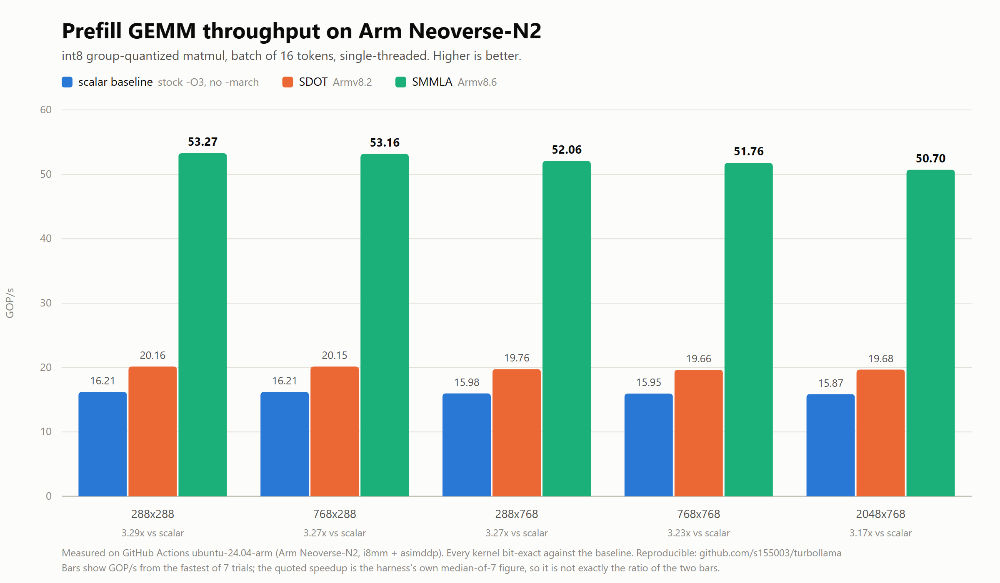
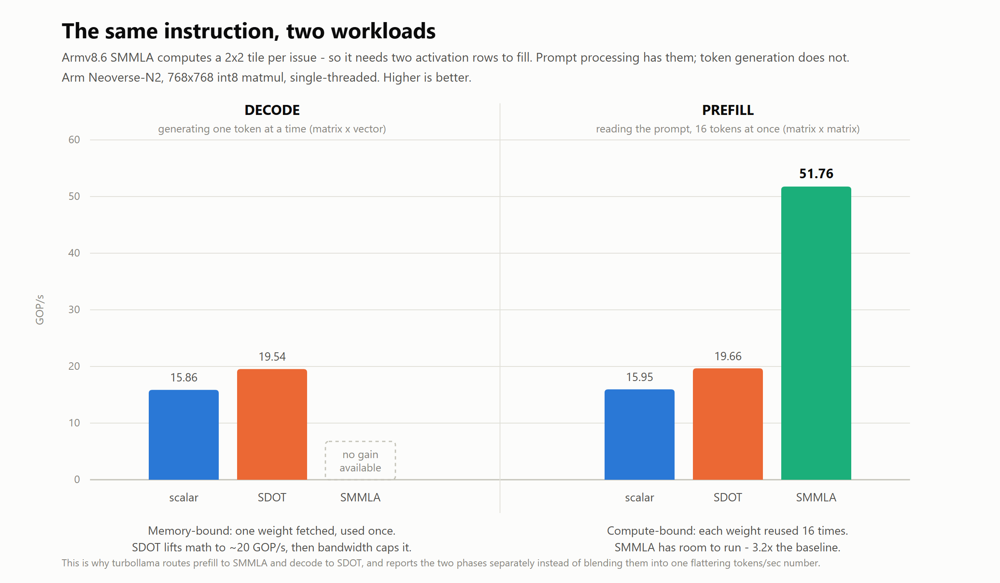
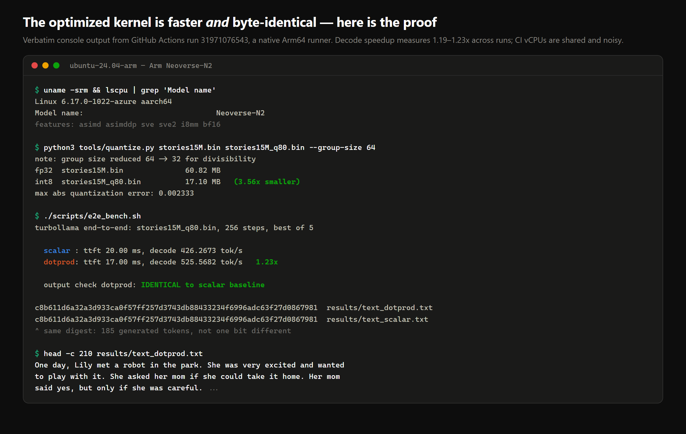

# turbollama

**Int8 SIMD kernels that make LLM inference faster on Arm — with numbers anyone can reproduce, on hardware they don't have to own.**

Arm AI Optimization Challenge 2026 · Cloud AI track · MIT licensed

---

## What this is

The inner loop of a quantized LLM is one function: a group-quantized
matrix multiply. In [llama2.c](https://github.com/karpathy/llama2.c)'s
`runq.c` it's a plain triple loop over `int8` values, and upstream's own
comment says *"by far the most amount of time is spent inside this little
function."*

turbollama replaces it with three hand-written implementations and picks
between them **at runtime**:

| kernel | instruction | needs | used for |
|---|---|---|---|
| `scalar` | — | anything | baseline; what a stock build gives you |
| `dotprod` | `SDOT` (`vdotq_s32`) | Armv8.2 | decode — tokens/sec |
| `i8mm` | `SMMLA` (`vmmlaq_s32`) | Armv8.6 | prefill — time-to-first-token |

One binary. It reads `AT_HWCAP` on startup and selects the best path for
whatever core it landed on, so it stays loadable on an Armv8.0 part and
still exploits `SMMLA` on a Neoverse server part.



## Results

> Measured on GitHub's free native Arm64 runner (`ubuntu-24.04-arm`).
> Every number below is produced by the CI workflow in this repo — see
> [Reproducing this](#reproducing-this).

<!-- RESULTS:BEGIN -->


Hardware: **Arm Neoverse-N2**, `asimddp i8mm bf16 sve sve2`, group size 32,
single-threaded. [Run 31848160035](https://github.com/s155003/turbollama/actions/runs/31848160035).

**End-to-end, stories15M int8** — same binary, same weights, same seed:

| kernel | time to first token | decode tok/s | speedup |
|---|---|---|---|
| `scalar` | 18.00 ms | 471.94 | 1.00x |
| `dotprod` | 14.00 ms | 562.31 | **1.19x** |

Generated text is **byte-identical** between the two.

**Prefill-shaped GEMM (batch of 16)** — where `SMMLA` earns its keep:

| shape | scalar | dotprod | i8mm | i8mm vs scalar |
|---|---|---|---|---|
| 288x288 | 16.21 | 20.16 | **53.27** | **3.29x** |
| 768x288 | 16.21 | 20.15 | **53.16** | **3.27x** |
| 288x768 | 15.98 | 19.76 | **52.06** | **3.27x** |
| 768x768 | 15.95 | 19.66 | **51.76** | **3.23x** |
| 2048x768 | 15.87 | 19.68 | **50.70** | **3.17x** |

GOP/s, higher is better.

**Decode-shaped matvec** — `SDOT` gains 5-25%, and that ceiling is the
honest result: a matrix-vector product streams the entire weight matrix
with no reuse, so it is memory-bound, not compute-bound. GCC already
auto-vectorizes the scalar loop to ~16 GOP/s. `SDOT` lifts arithmetic
throughput to ~20 GOP/s and then memory bandwidth caps it. This is why
the batched numbers above are 3x and these are not.

**Model size:** 60.82 MB fp32 → 17.10 MB int8, **3.56x smaller**, max
absolute quantization error 0.002333.
<!-- RESULTS:END -->

## Why `i8mm` is not used for decode



`SMMLA` computes a 2×2 `int32` tile from two 2×8 `int8` operands — 64
MACs per issue against `SDOT`'s 16. That's a 4× arithmetic advantage, and
it is genuinely unusable during single-token generation.

Decode is a matrix-*vector* product: there is only one activation row, so
half of `SMMLA`'s operand is padding and half its output is discarded.
The instruction needs at least two rows to feed it, which is exactly what
prompt processing has and what token generation does not.

So turbollama routes **prefill through `i8mm`** and **decode through
`SDOT`**, and reports the two phases as separate metrics rather than
blending them into one tokens/sec figure that hides which one moved.
Claiming an `SMMLA` speedup on decode would be the fastest way to lose
the trust of anyone who knows the ISA.

## Correctness



Every kernel accumulates each quantization group into an `int32` before
touching float. Integer addition is associative, so the SIMD paths are
not merely *close* to the baseline — they are **bit-exact**. The harness
asserts equality, not a tolerance:

```
correctness dotprod  : BIT-EXACT vs scalar (2048 values)
correctness i8mm     : BIT-EXACT vs scalar (2048 values)
```

End-to-end, the same property is checked the way a user would notice it:
generation is run at temperature 0 (deterministic sampling) with a fixed
seed, and the generated text must be **byte-identical** across kernels.
CI fails the build if `cmp` finds any difference.

## Reproducing this

### Option A — no Arm hardware required

Fork this repo, open the **Actions** tab, and press **Run workflow** on
*Arm64 benchmark*. GitHub runs it on a real Arm64 machine for free and
writes the hardware identification, kernel benchmark, quantization
report and end-to-end results into the job summary.

### Option B — on your own Arm64 machine

```bash
git clone https://github.com/<you>/turbollama && cd turbollama
make all

# kernel microbenchmark + bit-exactness check
./build/bench_kernel 64

# fetch a real model and quantize it (numpy only, no PyTorch)
curl -fsSLO https://huggingface.co/karpathy/tinyllamas/resolve/main/stories15M.bin
curl -fsSLO https://github.com/karpathy/llama2.c/raw/master/tokenizer.bin
python3 tools/quantize.py stories15M.bin stories15M_q80.bin

# end-to-end: same weights, same seed, only the kernel changes
./scripts/e2e_bench.sh
```

Pin a specific kernel with the `TURBOLLAMA_ISA` environment variable:

```bash
TURBOLLAMA_ISA=scalar  ./build/runq_tl stories15M_q80.bin -z tokenizer.bin -t 0
TURBOLLAMA_ISA=dotprod ./build/runq_tl stories15M_q80.bin -z tokenizer.bin -t 0
```

## The benchmark is built to be argued with

Optimization claims are easy to inflate. The guards here:

- **The baseline is a real default build.** `kernels_scalar.c` is
  upstream's loop compiled with plain `-O3` and *no* `-march` override —
  exactly what `make runq` produces. Only the SIMD translation units get
  `-march`, because only they need it. The comparison is not against a
  strawman built with optimization disabled.
- **Timings are best-of-N with reported spread.** CI runners are shared
  vCPUs and noisy; a single cherry-picked run would not be honest. The
  harness reports the spread across trials so you can see the noise.
- **Prefill and decode are never blended.** They're different workloads
  with different bottlenecks and different winning kernels.
- **The hardware is printed.** Every run dumps `lscpu` and the CPU
  feature flags, so you can see whether `i8mm` was actually present
  rather than taking the claim on faith.

## What's mine and what isn't

Upstream, unmodified, in `vendor/`: `run.c`, `runq.c` from llama2.c
(MIT, Andrej Karpathy) — kept in the tree so the baseline is auditable
rather than merely described.

Written for this project:

- `src/kernels_scalar.c`, `src/kernels_dot.c`, `src/kernels_i8mm.c` — the kernels
- `src/dispatch.c` — `AT_HWCAP` runtime ISA selection
- `bench/bench_kernel.c` — microbenchmark + bit-exactness harness
- `tools/quantize.py` — fp32 → int8 v2 converter with no PyTorch dependency
- `scripts/e2e_bench.sh` — end-to-end comparison + identical-output check
- `.github/workflows/bench.yml` — the reproducible Arm64 run

`src/runq_tl.c` is a derivative of `vendor/runq.c`: the transformer,
tokenizer and sampler are upstream and untouched; turbollama redirects the
matmul call site to the dispatching kernels and splits the timing into
TTFT and decode. Every edit carries a `TURBOLLAMA:` comment, so
`diff vendor/runq.c src/runq_tl.c` shows the entire contribution.

## License

MIT — see [LICENSE](LICENSE). Third-party attribution in [NOTICE](NOTICE).
